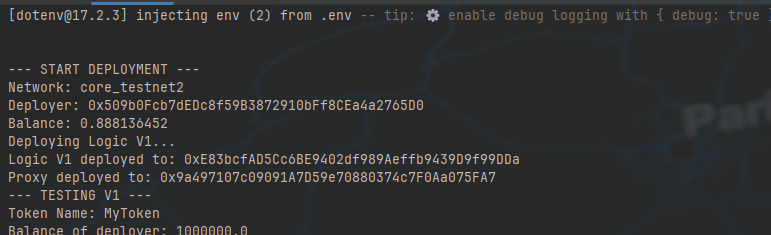
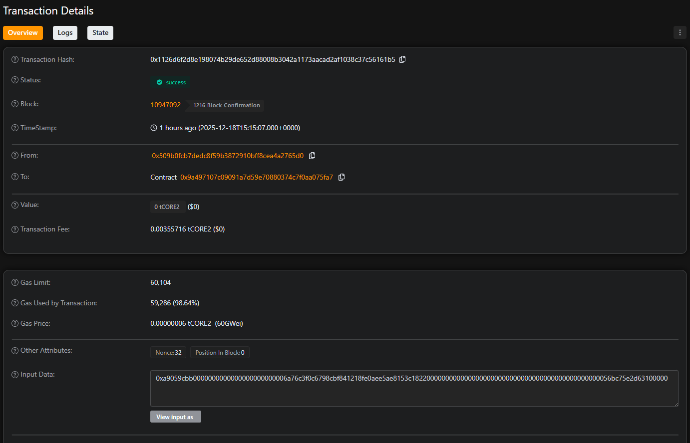
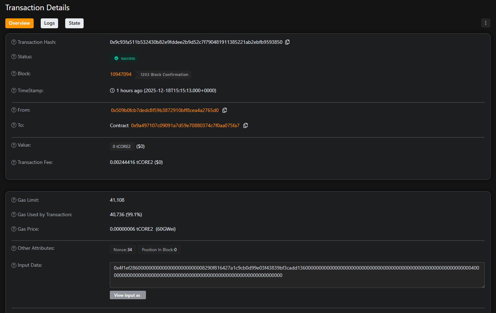
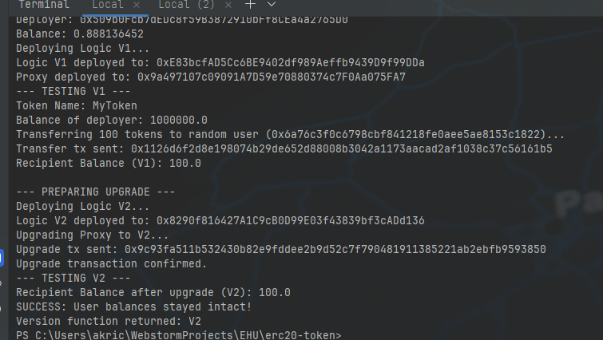

# This branch contains solutions of the Module 6 and the Module 7.

## You can find required files for the Module 6 and the Module 7 in the next folders: contracts, scripts, tests.

# Module 7: Upgradable Smart Contract Report (Proxy Pattern)

## 1. Project Overview
In this assignment, I implemented an upgradable ERC-20 token using the **UUPS (Universal Upgradeable Proxy Standard)** pattern. The architecture allows for updating the contract logic (Implementation) while preserving the contract state (Balances) and the contract address (Proxy).

The system consists of three main components:
1.  **Logic Contract V1:** The initial ERC-20 implementation.
2.  **Proxy Contract (ERC1967):** The storage layer that delegates calls to the logic contract.
3.  **Logic Contract V2:** The upgraded implementation with added functionality.

## 2. Execution & Verification (Proof of Work)

The following steps demonstrate the deployment, interaction, and successful upgrade of the contract on the **Core Blockchain Testnet 2**.

### Step A: Initial Deployment (V1 & Proxy)
The Logic V1 contract was deployed, followed by the Proxy contract initialized with the supply of 1,000,000 tokens.

*   **Logic V1 Address:** `0xE83bcfAD5Cc6BE9402df989Aeffb9439D9f99DDa`
*   **Proxy Address (The Token):** `0x9a497107c09091A7D59e70880374c7F0Aa075FA7`

> ****

### Step B: Interaction with V1 (State Change)
To prove that state is preserved during an upgrade, a transfer transaction was executed on the V1 logic.

*   **Action:** Transferred 100 MTK to a secondary account.
*   **Transfer Transaction Hash:** `0x1126d6f2d8e198074b29de652d88008b3042a1173aacad2af1038c37c56161b5`
*   **Explorer Link:** `https://scan.test2.btcs.network/tx/0x1126d6f2d8e198074b29de652d88008b3042a1173aacad2af1038c37c56161b5`

> ****

### Step C: The Upgrade Process
The Logic V2 contract was deployed, and the `upgradeToAndCall` function was executed on the Proxy to switch the implementation address.

*   **Logic V2 Address:** `0x8290f816427A1C9cB0D99E03f43839bf3cADd136`
*   **Upgrade Transaction Hash:** `0x9c93fa511b532430b82e9fddee2b9d52c7f790481911385221ab2ebfb9593850`
*   **Explorer Link:** `https://scan.test2.btcs.network/tx/0x9c93fa511b532430b82e9fddee2b9d52c7f790481911385221ab2ebfb9593850`

> ****

### Step D: Validation (V2 Features & State Preservation)
After the upgrade, two checks were performed:

1.  **State Integrity:** Verified that the user's balance remained `100 MTK`.
2.  **New Functionality:** Verified that the new `version()` function returns `"V2"`.

**Console Output Evidence:**
The following logs confirm that the User Balance (V1) matches the User Balance (V2) and the version function works.

> ****
> *(This screenshot should show: "SUCCESS: User balances stayed intact!" and "Version function returned: V2")*

## 3. Conclusion
This project successfully demonstrated the Proxy Pattern. By separating the storage (Proxy) from the logic (Implementation), we updated the smart contract's functionality without changing its address or losing critical user data (token balances).

